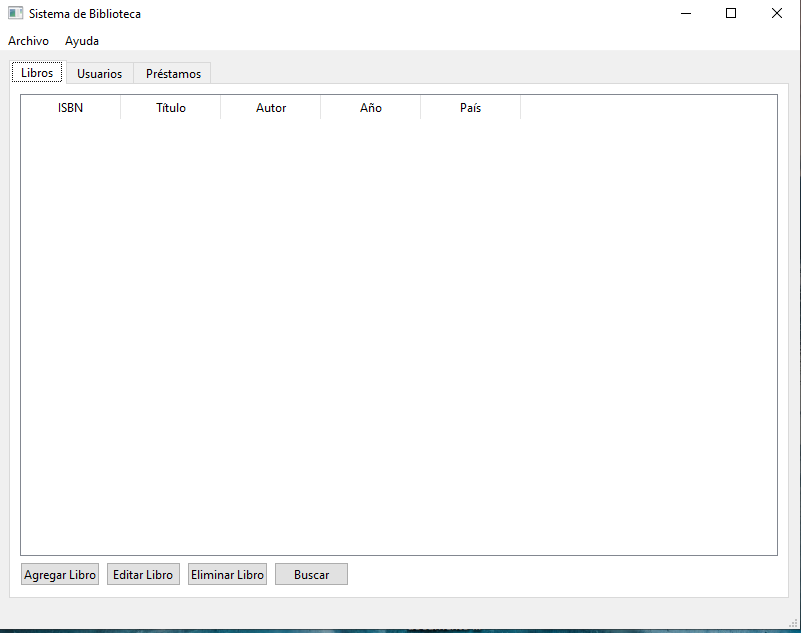

# 📚 Biblioteca 2.0

Una aplicación de biblioteca desarrollada en **C++**, utilizando **Qt 6** para la interfaz gráfica y **SQLite** como motor de base de datos.  
El objetivo es ofrecer una interfaz simple y funcional para la gestión de libros.

---

## ✨ Características principales
- Interfaz gráfica intuitiva con **Qt Widgets**.
- Base de datos local con **SQLite** para almacenar información de libros.
- Funciones básicas:
  - ➕ Agregar libros
  - ✏️ Editar registros
  - ❌ Eliminar entradas
  - 🔍 Buscar por título o autor
- Proyecto modular y fácil de extender.

---

## 🛠️ Tecnologías utilizadas
- **C++17**
- **Qt 6.10.2** (Widgets, SQL, AxContainer)
- **SQLite**
- **CMake** como sistema de build

---

## 🚀 Cómo compilar
1. Clonar el repositorio:
   ```bash
   git clone https://github.com/flony-hub/biblioteca2_0.git
   cd biblioteca2_0
2.Crear carpeta de build:
mkdir build && cd build
3.Configurar con CMake:
cmake ..
4.Compilar:
cmake --build .
📌 Notas
Requiere tener instalado Qt 6.10.2 (o superior) con soporte para MinGW 64-bit.

La carpeta build/ y archivos temporales están ignorados en .gitignore.

Compatible con Windows; puede adaptarse a Linux/macOS con ajustes menores.

🤝 Contribuciones
¡Las contribuciones son bienvenidas!
Si quieres mejorar la aplicación, abre un issue o envía un pull request.

📖 Licencia
Este proyecto se distribuye bajo la licencia MIT.
Puedes usarlo, modificarlo y compartirlo libremente, siempre mencionando la autoría original.


